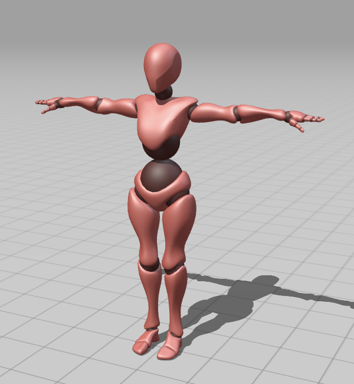
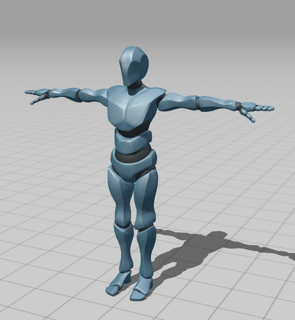
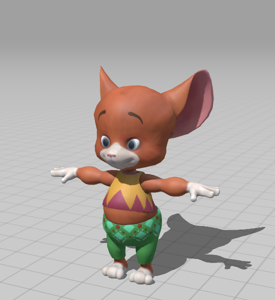
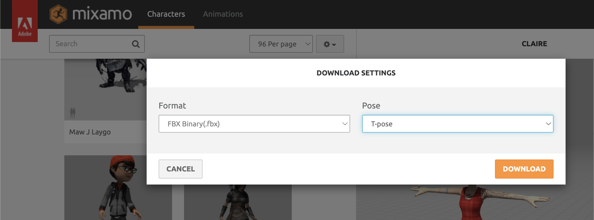
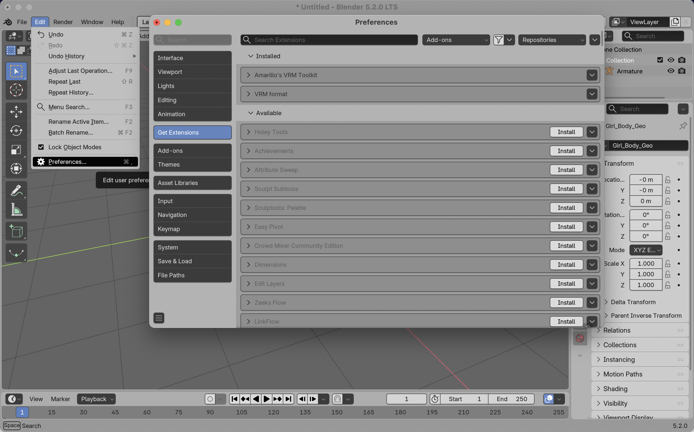
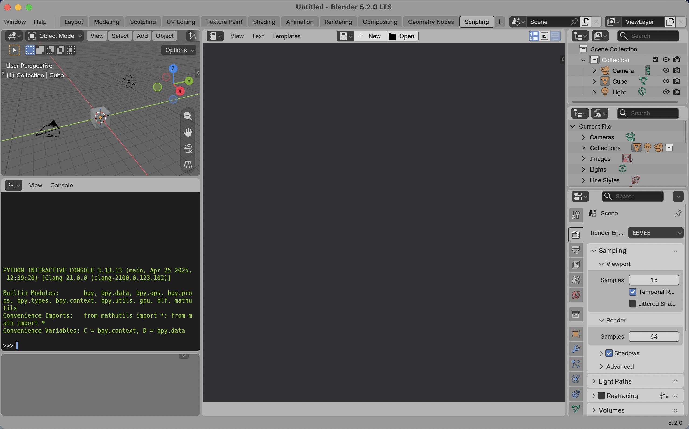
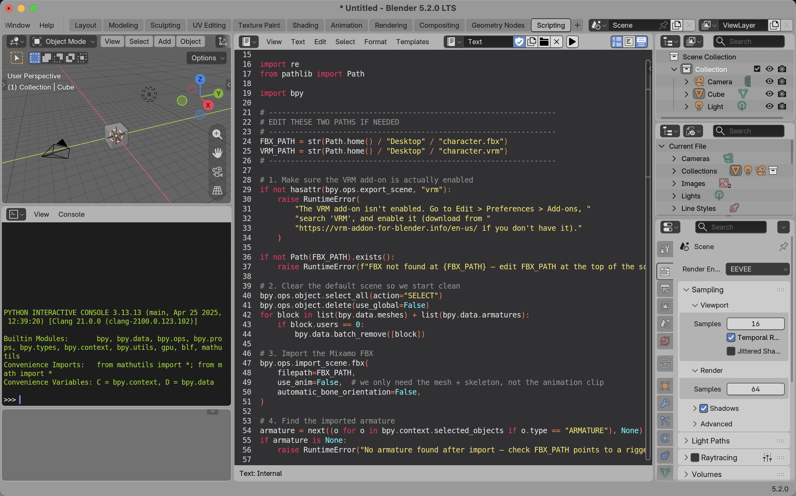

# Mixamo .vrm Characters

This repo:
- Hosts selected Mixamo characters in .vrm format - for download and use in your three.js projects.
- Shows a simple step-by-step workflow to convert a character, that you downloaded from Mixamo, from .fbx format to .vrm format.

## Characters available

 

X Bot

 

Y Bot

 

Claire

 

## .fbx to .vrm Conversion Workflow

1- Download the character from Mixamo 
Rename the file to: character.fbx 
Place the file on your desktop. 
https://www.mixamo.com/ 

2- Download and install Blender 
https://www.blender.org/

3- Install the VRM extension in Blender 
Edit -> Preferences -> Get Extensions 
Type "VRM" into the search bar 
Click Install 

4- In the top bar click "Scripting". It may be hidden so you will need to slide the other buttons to the left to be able to find it. 
Click "+ New" 

5- Copy the code from the mixamo_to_vrm.py file and paste it in blender. 
Then click the play button to run the code. 
A new file named character.vrm will appear on your desktop. 
You can rename this file and use it. 
 

The .fbx to .vrm conversion process is now complete.

 

## Notes
- Mixamo licensing conditions: 
https://community.adobe.com/questions-696/mixamo-faq-licensing-royalties-ownership-eula-and-tos-589400

